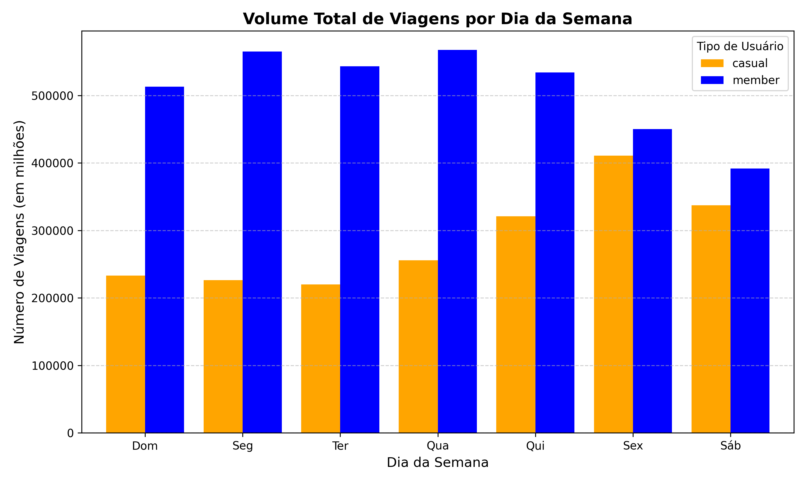

# Estudo de Caso: Análise Estratégica da Cyclistic 🚲

Este projeto faz parte do **Certificado Profissional de Análise de Dados do Google**. O objetivo é analisar o comportamento dos usuários de um sistema de compartilhamento de bicicletas (Cyclistic) para orientar estratégias de marketing focadas na conversão de usuários casuais em membros anuais.

## 📊 Visão Geral do Projeto
A análise explorou uma base de dados de **5,5 milhões de registros** (Big Data) referentes aos últimos 12 meses. O foco foi identificar como os "Membros Anuais" e "Ciclistas Casuais" utilizam as bicicletas de forma diferente.

## 🛠️ Tecnologias Utilizadas
* **Python 3.12**
* **Pandas**: Limpeza e manipulação de grandes volumes de dados.
* **Matplotlib**: Criação de visualizações estatísticas.
* **Glob**: Automação da leitura de múltiplos arquivos CSV.

## 🚀 Fases da Análise (Metodologia Google)

### 1. Limpeza e Processamento (Process)
Os dados brutos estavam distribuídos em 12 arquivos mensais. Utilizei Python para:
* Unificar todos os arquivos em um único DataFrame.
* Remover registros inválidos e inconsistências.
* Criar novas variáveis: `ride_length` (duração da viagem) e `day_of_week` (dia da semana).

### 2. Análise Descritiva (Analyze)
Os dados revelaram padrões distintos de comportamento:
* **Duração Média:** Usuários casuais pedalam por mais tempo (~22 min) do que membros (~12 min).
* **Volume Semanal:** Membros utilizam o serviço de forma consistente em dias úteis, enquanto casuais concentram o uso nos fins de semana.

### 3. Visualização dos Dados (Share)

*(Dica: certifique-se de que o nome da imagem no GitHub seja exatamente o que você salvou no Python)*

## 💡 Insights e Recomendações de Gestão (Act)
Com base nos dados, as recomendações estratégicas são:
1.  **Marketing Sazonal:** Criar campanhas específicas para fins de semana, focadas no público casual que já utiliza o serviço para lazer.
2.  **Planos Flexíveis:** Desenvolver um plano de adesão "Weekend Member" ou "Summer Pass" para capturar o público de viagens longas.
3.  **Comunicação Digital:** Focar anúncios nas estações de maior fluxo de usuários casuais durante os dias 6 (Sexta) e 7 (Sábado).

---
**Contato:**
[Julimar Pedro de Oliveira] - [www.linkedin.com/in/julimar-oliveira-59984a1a4]
